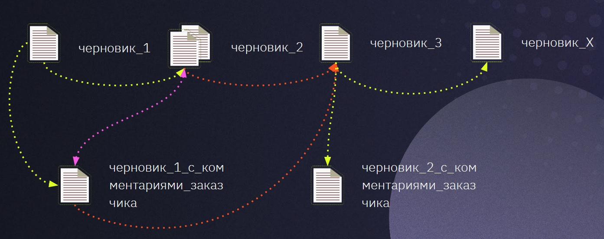

# Знакомство с Git
## Что такое Git и с чем его едят
**Git** — это программа для контроля версий (чего угодно, не обязательно исходного кода). Её придумал Линус Торвальдс — он же создал изначальное ярдро ОС Linux. Великий, в общем, человек.

Git нужен как для итерационной разработки продукта (версия 1.0, 1.2, 2.0 и т. д.), так и для командной работы над проектом — чтобы разные люди могли работать над разными участками кода, и итоговый результат не приходилось долго и муторно сводить вручную.

## Начало работы с Git. Первые команды
Git можно установить с помощью репозитория на [официальном сайте](https://git-scm.com/downloads). После установки можно открыть его в любом терминале (Git Bash или встроенный терминал программы). Мы пока работаем во встроенном терминале Visual Studio Code (Microsoft).

Все команды гита начинаются со слова **git**. Так терминал узнаёт, что мы обращаемся именно к этой программе.

### git --version
Команда позволяет узнать, какая версия программы у нас установлена.

### git config --global user.name "[Имя пользователя латиницей]"
Перед началом работы с гитом надо ему единожды представиться. Это может быть рандомное имя, но при работе в команде это должно быть имя, по которому тебя можно идентифицировать — поскольку имя проставляется при всех коммитах (о том, что это такое, — ниже).

### git config --global user.email "[E-mail пользователя латиницей]"
То же самое, что и предыдущая команда, только про электронную почту.

### git config --list
С помощью этой команды можно проверить, какие имена и e-mail's мы навводили (внизу списка). Также увидеть, какие ещё есть конфигурации в списке.

## Работа с репозиторием
Для начала нужно убедиться, что мы находимся в нужной папке — именно в той, в которой мы хотим создать репозиторий. Папку можно открыть через меню *File => Open Folder…* или с помощью горячих клавиш *Ctrl+O*.

Далее путь к этой папке должен отображаться в терминале. Если в терминале отображается не тот путь, то его можно сменить с помощью команды **git cd "имя папки"**.

### git init
Команда создаёт пустой репозиторий в указанной папке (в виде скрытой папки)

### git status
Выводит текущий статус гита в этой папке: показывает, в какой ветке мы сейчас находимся, есть ли добавленные, но не закомиченные данные, есть ли неотслеживаемые файлы и т. д.

### git add "Имя файла.расширение"
Команда добавляет в репозиторий файл в его нынешнем состоянии. Файл при каждом внесении изменений нужно добавлять заново. Если обновить нужно все файлы, то можно добавлять все файлы в директории командой **git add .** — с точкой через пробел.

Важные моменты:
* перед собавлением файла обязательно нужно сохранить все нужные изменения;
* при добавлении файла обязательно нужно указывать его расширение.

### git commit -m "Содержание коммента к комиту"
Команда добавляет commit — то есть фиксирует текущую версию добавленных файлов в репозитории, создаёт для них контрольную точку. С помощью флага **-m** добавляется комментарий к комиту — в прямых скобках. Комментарий можно не добавлять, но тогда Git начинает ругаться — да и с точки зрения контроля версий лучше не делать некомментированные коммиты.

### git diff
Команда призвана показать, какова разница между текущим файлом и последним комитом. Важно: как только комит отправлен, разница перестаёт отображаться.

### git log
Команда позволяет посмотреть на лог операций гита — то есть вывести на экран все последние комиты. Комиты выводятся в порядке «От самых свежих к самым ранним».

### git checkout [первые четыре символа из номера комита]
С помощью этой команды можно переключаться между разными зафиксированными версиями файла (то есть между разными комитами). Номер комита можно посмотреть в логе гита (см. команду **git log**).

### git checkout master
Команда перекидывает нас в самый конец ветки **master**, в самую-самую свежую зафиксированную версию. Если мы работаем в другой ветке, вместо **master** нужно написать её название.

## Углубляем знакомство с Git. Ветвление версий
Работа над продуктом может быть не только итерационной, но и параллельной — например, для разных исполнителей или разных задач (см. пример с параллельной работой и внесением правок заказчика).

Для таких случаев в Гите есть возможность разбивать разработку проекта по разным веткам. Для этого используется следующий набор команд.

### git branch
Команда выводит список всех имеющихся в репозитории веток и выделяет (звёздочкой и цветом), в какой ветке мы сейчас работаем.

### git branch [имя_новой_ветки]
Команда создаёт новую ветку. Имя ветки нужно писать латиницей, а если оно состоит из нескольких слов — через нижнее подчёркивание. **ВАЖНО**: эта команда только создаёт ветку, но не перекидывает в неё!

### git checkout [имя_ветки]
А вот эта команда — как раз перекидывает в ветку с указанным именем (без квадратных скобок, здесь они символизируют плейсхолдер).

**ВАЖНО**:
* команда перекидывает в самый верх ветки. Если нужен конкретный комит — к нему надо переходит через **git checkout [первые четыре символа номера комита]**;
* **git log** всегда показывает все комиты, а не только комиты конкретной ветки. При этом в логе написана ветка, в которой произведён комит (в скобках, после номера комита).

### git branch -d [имя_ветки_которую_нужно_удалить]
Этой командой можно удалить ветку, которая нам больше не нужна.

**ВАЖНО**: Ветка удаляется безвозвратно, целиком и удаляет вместе с собой все свои комиты, так что act cautiously. При этом, если в ветке больше инфы, чем в других (или, может, если инфа была добавлена позже, пока не понимаю), Гит будет ругаться, спрашивать, уверен ли ты в своём опрометчивом решении, и даст удалить ветку только с флагом *-D* вместо *-d* (то есть прописной буквой вместо строчной).
Этой командой можно удалить ветку, которая нам больше не нужна.

**ВАЖНО**: Ветка удаляется безвозвратно, целиком и удаляет вместо с собой все свои комиты, так что act cautiously. При этом, если в ветке больше инфы, чем в других (или, может, если инфа была добавлена позже, пока не понимаю), Гит будет ругаться, спрашивать, уверен ли ты в своём отпрметчивом решении и даст удалить ветку только с флагом *-D* вместо *-d* (то есть прописной буквой вместо строчной).

### git merge [имя_ветки_которую_мы_хотим_влить_в_текущую]
Как несложно догадаться, сливает указанную в команде ветку с текущей (текущая — акцептор, указанная — донор). Из-за этого порой случаются конфликты, которые Гит предлагает решить тремя способами: выбрав вариант из одной ветки, выбрав вариант из другой и взяв всё лучшее сразу (то есть, насколько я понимаю, максимально полный вариант).

## Бонус-трек: визуализируем лог прямо в консоли
Все эти безобразия, которые мы творим с вливанием и разливанием веток, можно визуализировать прямо в консоли и средствами терминала. Для этого нужно набрать команду

### git log --graph

## Работа с удалёнными репозиториями
Сложно поверить, но всё, что мы делали до сих пор — это работа с локальным репозиторием. Он создаётся на нашем компьютере, живёт на нашем компьютере и умирает на нашем компьютере (интересно, кстати, работает ли это на локалке — вообще должно, но надо проверить). Для того чтобы работать распределённой-удалённой командой (а также для того чтобы  делиться с миром нашим гениальным кодом), нужны удалённые репозитории. Есть много проектов, поддерживающих создание удалённых репозиториев, но самым, наверно, известным является **GitHub**. Вот на него-то мы и забуримся (тем более что VSCode имеет инструменты для быстрой работы именно с ним).

Сначала мы регимся на GitHub, коннектим его с VSCode и вручную создаём репозиторий в своём профиле (можно и сразу из VSCode пушить, но тогда он пытается подцепить в качестве имени репозитория имя папки, а это не всегда уместно).

### git clone [полный URL удалённого репозитория]
Команда позволяет скопировать внешний репозиторий на наш компьютер.

### git pull
Команда скачивает всё из текущего репозитория и автоматически смержить его с нашей версией.

### git remote add [имя проекта] [URL проекта]
Если мы заранее создали удалённый репозиторий и хотим влить наш локальный в него, команда позволит из связать.

### git push
Команда отправляет ~~всё, что нажито непосильным трудом~~ текущую версию репозитория во внешний репозиторий.

**ВАЖНО**: требуется предварительная авторизация во внешнем репозитории. Если мы работаем из VSCode (или другой программы), то авторизацию нужно провести внутри неё.

## Такая штука, как Pull Request
Обычно мы работаем командаой над одним проектом примерно так: есть основной рабочий билд, он залит на удалённый репозиторий. Перед началом работы мы создаём fork (ответвление) этого билда и делаем **git clone** своей версии репозитория.

Далее мы создаём новую ветку для конкретной задачи и работает в ней. Работаем-работаем, добавляем, 
